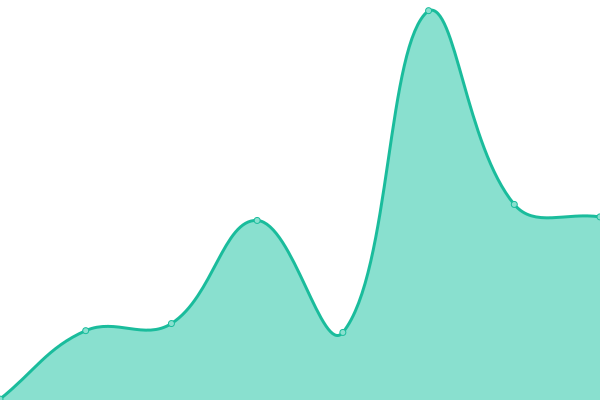

# [📈 Live Status](https://status.kitki30.tk/): <!--live status--> **🟧 Partial outage**

<!--start: status pages-->
<!-- This summary is generated by Upptime (https://github.com/upptime/upptime) -->
<!-- Do not edit this manually, your changes will be overwritten -->
<!-- prettier-ignore -->
| URL | Status | History | Response Time | Uptime |
| --- | ------ | ------- | ------------- | ------ |
|  [The Earth War Website](https://www.kitki30.tk) | 🟩 Up | [the-earth-war-website.yml](https://github.com/A-Kipl-Studio/Service-Status/commits/HEAD/history/the-earth-war-website.yml) | 

 247ms
     
 | 

<a href="https://status.kitki30.tk/history/the-earth-war-website">100.00%</a>
    

|  [The Earth War API](https://api.kitki30.tk) | 🟥 Down | [the-earth-war-api.yml](https://github.com/A-Kipl-Studio/Service-Status/commits/HEAD/history/the-earth-war-api.yml) | 

 360ms
     
 | 

<a href="https://status.kitki30.tk/history/the-earth-war-api">3.80%</a>
    

<!--end: status pages-->

## 📄 License

- Powered by: [Upptime](https://github.com/upptime/upptime)
- Code: [MIT](./LICENSE) © [Anand Chowdhary](https://anandchowdhary.com), supported by [Pabio](https://pabio.com)
- Data in the `./history` directory: [Open Database License](https://opendatacommons.org/licenses/odbl/1-0/)
